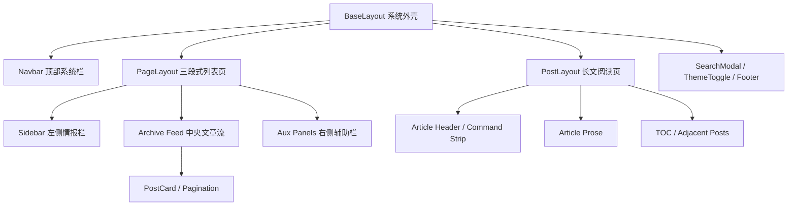

# 变更提案: blog-pen-front-redesign

## 元信息
```yaml
类型: 重构/优化
方案类型: implementation
优先级: P1
状态: 已确认
创建: 2026-03-27
```

---

## 1. 需求

### 背景
当前博客已经具备完整的 Astro 内容链路和终端风格基础，但整体视觉仍偏“原型复刻后的两栏博客”。根目录的 `blog.pen` 提供了更强烈的控制台仪表语言，包括高密度边框、命令条、实时面板和三栏信息架构。用户希望以 `blog.pen` 为参照，重新设计整个博客前端界面，并覆盖首页、文章页、分类/标签页以及导航、侧栏、页脚等公共组件。

### 目标
- 将 `blog.pen` 的“控制台/作战台”语言转译成适合真实阅读的博客外观，而不是机械复刻 dashboard。
- 统一首页、列表页、文章页和公共组件的视觉系统，让桌面端与移动端都形成稳定、完整的浏览体验。
- 保持现有 Astro 内容数据流、base-aware 链接、搜索、主题切换和 TOC 能力，不做无关重构。
- 以 `pnpm build` 通过作为阻断性验收条件。

### 约束条件
```yaml
时间约束: 本次在现有工程上直接迭代，不重新搭建项目
性能约束: 保持 Astro 静态输出和轻量浏览器增强，不引入前端框架运行时
兼容性约束: 必须保留 GitHub Pages 的 /blog 子路径兼容，所有站内链接与静态资源继续 base-aware
业务约束: 覆盖首页、文章页、分类/标签页与公共组件；保留现有 Markdown 内容模型、搜索、主题切换和 TOC 交互
```

### 验收标准
- [ ] 首页、文章页、分类页、标签页及导航/侧栏/页脚完成统一重设计，并明显体现 `blog.pen` 的控制台视觉基因
- [ ] 桌面端采用更强的多区域信息架构，移动端在不丢失主视觉的前提下完成合理折叠与重排
- [ ] 搜索模态、主题切换、分页、TOC、站内链接和 `base=/blog` 行为保持正常
- [ ] `pnpm build` 通过，且无新增阻断性构建错误

---

## 2. 方案

### 技术方案
采用“控制台外壳 + 阅读核心”的转译方案重构现有 Astro 界面。具体做法如下：

1. 在 `src/styles/global.css` 中重建全局视觉 token 与组件语义类，将 `blog.pen` 的深蓝黑背景、青绿/电蓝高亮、细描边面板、命令条和雷达式信息块沉淀为共享样式基础。
2. 重做 `BaseLayout` 和 `Navbar`，引入更贴近 `blog.pen` 的顶部系统栏与页面外框，让整站形成统一的控制台壳层。
3. 重做 `PageLayout`、`Sidebar`、`PostCard`、`Pagination` 和分类/标签列表页，使首页和归档页采用“三段式信息结构”：左侧情报栏、中间主归档流、右侧辅助面板。
4. 重做 `PostLayout` 与 `TOC`，保留长文阅读的留白和层级，但用命令条、状态块、章节导航与相邻文章面板承接新的控制台气质。
5. 保持 `SearchModal`、`ThemeToggle` 与数据工具逻辑不变或最小修改，只调整视觉、交互反馈和布局接口。

### 方案对比
| 方案 | 核心思路 | 优点 | 缺点 |
|------|------|------|------|
| A: Control-Room Editorial | 以 `blog.pen` 的三栏控制台为外壳，中间区域保持清晰阅读节奏 | 最平衡，既有明显改版，也不牺牲内容阅读 | 需要较多联动改造布局与样式 |
| B: Poster Archive | 强化首页海报感与品牌标题，只把控制台元素保留在局部模块 | 视觉更轻、更易做出“设计感” | 与 `blog.pen` 的对应关系偏弱，整站统一性不足 |
| C: Dashboard Faithful | 最大程度复刻 `blog.pen` 的信息密度与面板结构 | 与设计稿最接近，辨识度高 | 文章页和移动端阅读体验风险最高 |

本方案选择 A，并在文章页上进一步降低面板噪声，避免正文区退化成 dashboard。

### 影响范围
```yaml
涉及模块:
  - site-shell: BaseLayout、PageLayout、PostLayout、Navbar、Sidebar、Footer、PostCard、Pagination 的布局与样式接口全部重做
  - interactive-enhancements: SearchModal、ThemeToggle、TOC 视觉语言和容器结构调整
  - pages: 首页、分页、分类页、标签页、About、文章详情页联动适配新壳层
  - styles: global.css 作为本次重设计的主要落点，重建设计 token、版式和交互语义类
预计变更文件: 12-16
```

### 风险评估
| 风险 | 等级 | 应对 |
|------|------|------|
| 过度贴近 dashboard 导致文章页可读性下降 | 高 | 采用“控制台外壳 + 阅读核心”策略，正文区降低边框与密度，保留舒适行宽与段落留白 |
| 三栏布局在移动端塌陷后失去层次 | 中 | 先定义桌面信息优先级，再为平板/移动端设计明确的折叠顺序和模块压缩规则 |
| 全局样式大改带来组件回归问题 | 中 | 优先改造共享布局和语义类，再逐页收口；最后统一跑 `pnpm build` 验证 |
| `base=/blog`、搜索入口和内部链接在结构重组后失效 | 中 | 保持数据工具和 URL 派生函数为单一来源，避免对路径逻辑做无关重构 |

---

## 3. 技术设计（可选）

> 本次无后端或数据模型变更，但涉及整站布局重组，需要记录页面结构设计。

### 架构设计


### 页面结构设计
| 区域 | 桌面端职责 | 移动端策略 |
|------|------|------|
| 顶部系统栏 | 品牌、主导航、搜索、主题切换、当前模式提示 | 保留品牌和核心动作，导航折叠为菜单 |
| 左侧情报栏 | 品牌、搜索入口、站点统计、分类索引 | 折叠到主内容后方，保留关键摘要 |
| 中央主内容 | 首页文章流、分类/标签结果、About 正文、文章正文 | 保持最高优先级，始终先展示 |
| 右侧辅助栏 | 首页状态卡、文章页 TOC、快捷跳转/标签雷达 | 在窄屏下下沉为次级区块 |

---

## 4. 核心场景

> 执行完成后同步到对应模块文档

### 场景: 首页归档浏览
**模块**: site-shell
**条件**: 用户访问首页或分页页
**行为**: 页面展示顶部系统栏、左侧情报栏、中间文章流和右侧辅助面板，文章卡片以视觉摘要形式呈现内容
**结果**: 用户能快速扫描博客内容与站点状态，并感知 `blog.pen` 的控制台风格

### 场景: 文章深度阅读
**模块**: site-shell / interactive-enhancements
**条件**: 用户进入文章详情页
**行为**: 页面保留统一系统外壳，在正文前提供文章命令条、元信息和状态块，右侧提供 TOC 与导航
**结果**: 阅读体验保持流畅，同时视觉上与首页属于同一套系统

### 场景: 搜索与分类导航
**模块**: interactive-enhancements / content-pipeline
**条件**: 用户通过搜索、分类或标签浏览内容
**行为**: 搜索模态、分类页和标签页复用新的控制台视觉语言和列表布局
**结果**: 导航体验统一，不出现旧样式残留

### 场景: 响应式重排
**模块**: styles / site-shell
**条件**: 用户使用平板或手机访问
**行为**: 三栏布局按优先级折叠，主内容先显示，情报栏与辅助栏后置或折叠
**结果**: 视觉识别度仍在，且移动端不会因信息密度过高而难以使用

---

## 5. 技术决策

> 本方案涉及的技术决策，归档后成为决策的唯一完整记录

### blog-pen-front-redesign#D001: 将 blog.pen 转译为“控制台外壳 + 阅读核心”
**日期**: 2026-03-27
**状态**: ✅采纳
**背景**: `blog.pen` 本身是高密度的博客控制台视图，但现有站点是以文章阅读为核心的真实博客。如果直接一比一复刻 dashboard，文章页和移动端会明显受损；如果只借用少量颜色与图标，又无法体现“按照 blog.pen 重设计”的目标。
**选项分析**:
| 选项 | 优点 | 缺点 |
|------|------|------|
| A: Control-Room Editorial | 最能平衡设计稿气质、真实阅读体验和整站统一性 | 需要同时处理首页和文章页的不同密度 |
| B: Poster Archive | 首页容易做出强烈视觉 | 与 `blog.pen` 的结构对应较弱 |
| C: Dashboard Faithful | 视觉还原度最高 | 长文阅读与移动端风险最大 |
**决策**: 选择方案 A
**理由**: 用户要求“按照我的 `blog.pen` 重新设计博客前端”，因此不能只做表面换色；同时博客是内容产品，正文必须优先于仪表盘感。方案 A 能把设计稿的系统感、情报面板和命令条保留下来，同时把阅读区做得更克制。
**影响**: 影响 `src/styles/global.css`、所有共享布局组件、列表页与文章页结构，以及搜索/目录等增强组件的容器样式
